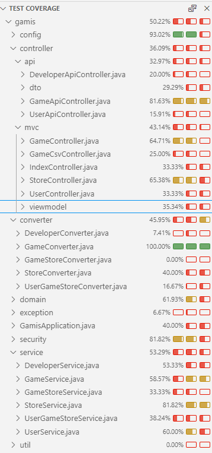

# Prog5 Gamis App

A Java Spring Web Application for managing your video game library across different stores and platforms.

## Table of contents
- [Week 1 - Information](#week-1---information)
- [Week 2 - HTTP GET and DELETE](#week-2---http-get-and-delete)
- [Week 3 - HTTP POST and PATCH](#week-3---http-post-and-patch)
- [Week 4 and 5 - Security, User roles](#week-4-and-5---security-and-user-roles)
- [Week 6 - Profiles](#week-6---profiles)
- [Week 7 and 8 - Tests](#week-7-and-8---tests)
- [Week 11 - Frontend](#week-11---frontend)
- [Week 12 - CI](#week-12---ci)

## Week 1 - Information:
- First Name: **Rostislav**
- Last Name: **Rucka**
- Email: **rostislav.rucka at student.kdg.be**
- ID: **TBA**
- Year: 2023/24
- Class: **ACS202**
- Course: **Programming 5**

#### Domain Entities
- Developer
- Game
- Store
- User

#### Build and run instructions
```bash
TODO
```

#### Test instructions
```
./gradlew test
```

## Week 2 - HTTP GET and DELETE

#### Fetching all games, expected 200
```
GET http://localhost:8080/api/games HTTP/1.1
Accept: application/json
```

```
[
    {
        "id": 1,
        "title": "Counter-Strike 2",
        "description": "relaunched",
        "developer": {
            "developerId": 2,
            "name": "Hidden Path Entertainment",
            "founded": "2006-08-24",
            "country": "United States"
        },
        "stores": [
            {
                "id": 1,
                "store": {
                    "id": 1,
                    "name": "Steam",
                    "isLibraryOnline": true,
                    "linkToLibrary": null
                },
                "releaseDate": "2011-08-23T00:00:00",
                "price": 0.0
            },
            {
                "id": 2,
                "store": {
                    "id": 2,
                    "name": "Epic Games",
                    "isLibraryOnline": true,
                    "linkToLibrary": null
                },
                "releaseDate": "2011-08-23T00:00:00",
                "price": 0.0
            },
            {
                "id": 3,
                "store": {
                    "id": 3,
                    "name": "Origin",
                    "isLibraryOnline": true,
                    "linkToLibrary": null
                },
                "releaseDate": "2011-08-23T00:00:00",
                "price": 0.0
            },
            {
                "id": 4,
                "store": {
                    "id": 4,
                    "name": "Uplay",
                    "isLibraryOnline": false,
                    "linkToLibrary": null
                },
                "releaseDate": "2011-08-23T00:00:00",
                "price": 0.0
            }
        ]
    },
    {
        "id": 3,
        "title": "Age of Empires II: Definitive Edition",
        "description": "Age of Empires II: Definitive Edition celebrates the 20th anniversary of one of the most popular strategy games ever with stunning 4K Ultra HD graphics, a new and fully remastered soundtrack, and brand-new content.",
        "developer": {
            "developerId": 3,
            "name": "Forgotten Empires",
            "founded": "2013-08-24",
            "country": "Netherlands"
        },
        "stores": [
            {
                "id": 6,
                "store": {
                    "id": 1,
                    "name": "Steam",
                    "isLibraryOnline": true,
                    "linkToLibrary": null
                },
                "releaseDate": "2019-11-14T00:00:00",
                "price": 19.99
            },
            {
                "id": 7,
                "store": {
                    "id": 2,
                    "name": "Epic Games",
                    "isLibraryOnline": true,
                    "linkToLibrary": null
                },
                "releaseDate": "2019-12-03T00:00:00",
                "price": 19.99
            },
            {
                "id": 8,
                "store": {
                    "id": 3,
                    "name": "Origin",
                    "isLibraryOnline": true,
                    "linkToLibrary": null
                },
                "releaseDate": "2020-01-20T00:00:00",
                "price": 17.99
            },
            {
                "id": 9,
                "store": {
                    "id": 4,
                    "name": "Uplay",
                    "isLibraryOnline": false,
                    "linkToLibrary": null
                },
                "releaseDate": "2020-10-04T00:00:00",
                "price": 15.99
            }
        ]
    },
    {
        "id": 5,
        "title": "Counter-Strike 2",
        "description": "relaunched",
        "developer": {
            "developerId": 2,
            "name": "Hidden Path Entertainment",
            "founded": "2006-08-24",
            "country": "United States"
        },
        "stores": []
    },
    {
        "id": 6,
        "title": "Counter-Strike 2",
        "description": "relaunched",
        "developer": {
            "developerId": 2,
            "name": "Hidden Path Entertainment",
            "founded": "2006-08-24",
            "country": "United States"
        },
        "stores": []
    },
    {
        "id": 7,
        "title": "Counter-Strike 2",
        "description": "relaunched",
        "developer": {
            "developerId": 2,
            "name": "Hidden Path Entertainment",
            "founded": "2006-08-24",
            "country": "United States"
        },
        "stores": []
    }
]
```

#### Fetch game, expected 200
```
GET http://localhost:8080/api/games/4 HTTP/1.1
Accept: application/json
```
```
{
    "id": 4,
    "title": "God of War",
    "description": "His vengeance against the gods of Olympus far behind him, Kratos now lives in the lands of Norse Gods and monsters. It is in this harsh, unforgiving world that he must fight to survive… and teach his son to do the same.",
    "developer": {
        "developerId": 4,
        "name": "Santa Monica Studio",
        "founded": "1999-08-24",
        "country": "United States"
    },
    "stores": [
        {
            "id": 10,
            "store": {
                "id": 2,
                "name": "Epic Games",
                "isLibraryOnline": true,
                "linkToLibrary": null
            },
            "releaseDate": "2022-01-14T00:00:00",
            "price": 49.99
        }
    ]
}
```

#### Remove game by id while NOT authenticated, expected 401
```
DELETE http://localhost:8080/api/games/1 HTTP/1.1
```
```

```

#### Remove game by id while authenticated, expected 204
```
DELETE http://localhost:8080/api/games/1 HTTP/1.1
Cookie: JSESSIONID=D941A641D383C7CA7912AFE28ACAD70B
X-CSRF-TOKEN: JTDBeOI37h1LkELEJk5zvxrts7l9rmXk2O0Qd8hCIjBmpLXMRwn4HYQP2i9mp3v3FWNH2SzcnthEmwbJu9UjRP16QQdfkdf6
```

#### Remove game by nonexistent id, expected 404
```
DELETE http://localhost:8080/api/games/1239 HTTP/1.1
Cookie: JSESSIONID=D941A641D383C7CA7912AFE28ACAD70B
X-CSRF-TOKEN: JTDBeOI37h1LkELEJk5zvxrts7l9rmXk2O0Qd8hCIjBmpLXMRwn4HYQP2i9mp3v3FWNH2SzcnthEmwbJu9UjRP16QQdfkdf6
```

## Week 3 - HTTP POST and PATCH

#### Create game while NOT authenticated, expected 401
```
POST http://localhost:8080/api/games
Accept: application/json
Content-Type: application/json

{
    "title": "Team Fortress 2",
    "description": "Team Fortress 2 is a team-based multiplayer first-person shooter video game.",
    "developerId": 1
}
```

#### Create game while authenticated, expected 201
```
POST http://localhost:8080/api/games
Accept: application/json
Content-Type: application/json
Cookie: JSESSIONID=D941A641D383C7CA7912AFE28ACAD70B
X-CSRF-TOKEN: JTDBeOI37h1LkELEJk5zvxrts7l9rmXk2O0Qd8hCIjBmpLXMRwn4HYQP2i9mp3v3FWNH2SzcnthEmwbJu9UjRP16QQdfkdf6

{
    "title": "Team Fortress 2",
    "description": "Team Fortress 2 is a team-based multiplayer first-person shooter video game.",
    "developerId": 1
}
```
```
{
    "id": 5,
    "title": "Counter-Strike 2",
    "description": "relaunched",
    "developer": {
        "developerId": 2,
        "name": "Hidden Path Entertainment",
        "founded": "2006-08-24",
        "country": "United States"
    },
    "stores": null
}
```

#### Create game with invalid body, expected 400
```
POST http://localhost:8080/api/games
Accept: application/json
Content-Type: application/json

{
    "title": "",
    "description": "Team Fortress 2 is a team-based multiplayer first-person shooter video game.",
    "developerId": 1
}
```
```
{
    "status": 400,
    "message": "validation error",
    "fieldErrors": [
        {
            "codes": null,
            "arguments": null,
            "defaultMessage": "Name is required",
            "objectName": "title",
            "field": "Name is required",
            "rejectedValue": null,
            "bindingFailure": false,
            "code": null
        },
        {
            "codes": null,
            "arguments": null,
            "defaultMessage": "Name must be at least 2 characters",
            "objectName": "title",
            "field": "Name must be at least 2 characters",
            "rejectedValue": null,
            "bindingFailure": false,
            "code": null
        }
    ]
}
```

#### Update game while NOT authenticated, expected 401
```
PATCH http://localhost:8080/api/games/1
Accept: application/json
Content-Type: application/json

{
    "title": "Counter-Strike 2",
    "description": "Elite competitive experience. This is Counter-Strike 2.",
    "developerId": "2"
}
```

#### Update game while authenticated, expected 200
```
PATCH http://localhost:8080/api/games/1
Accept: application/json
Content-Type: application/json
Cookie: JSESSIONID=D941A641D383C7CA7912AFE28ACAD70B
X-CSRF-TOKEN: JTDBeOI37h1LkELEJk5zvxrts7l9rmXk2O0Qd8hCIjBmpLXMRwn4HYQP2i9mp3v3FWNH2SzcnthEmwbJu9UjRP16QQdfkdf6

{
    "title": "Counter-Strike 2",
    "description": "Elite competitive experience. This is Counter-Strike 2.",
    "developerId": "2"
}
```

#### Update nonexistent game, expected 404
```
PATCH http://localhost:8080/api/games/1239462
Accept: application/json
Content-Type: application/json
Cookie: JSESSIONID=D941A641D383C7CA7912AFE28ACAD70B
X-CSRF-TOKEN: JTDBeOI37h1LkELEJk5zvxrts7l9rmXk2O0Qd8hCIjBmpLXMRwn4HYQP2i9mp3v3FWNH2SzcnthEmwbJu9UjRP16QQdfkdf6

{
    "title": "Counter-Strike 2",
    "description": "Elite competitive experience. This is Counter-Strike 2.",
    "developerId": "2"
}
```

#### Update game with missing title, expected 400
```
PATCH http://localhost:8080/api/games/1
Accept: application/json
Content-Type: application/json
Cookie: JSESSIONID=D941A641D383C7CA7912AFE28ACAD70B
X-CSRF-TOKEN: JTDBeOI37h1LkELEJk5zvxrts7l9rmXk2O0Qd8hCIjBmpLXMRwn4HYQP2i9mp3v3FWNH2SzcnthEmwbJu9UjRP16QQdfkdf6

{
    "description": "Elite competitive experience. This is Counter-Strike 2.",
    "developerId": "2"
}
```
```
{
    "status": 400,
    "message": "validation error",
    "fieldErrors": [
        {
            "codes": null,
            "arguments": null,
            "defaultMessage": "Description must be less than 255 characters",
            "objectName": "description",
            "field": "Description must be less than 255 characters",
            "rejectedValue": null,
            "bindingFailure": false,
            "code": null
        },
        {
            "codes": null,
            "arguments": null,
            "defaultMessage": "must be greater than or equal to 1",
            "objectName": "developerId",
            "field": "must be greater than or equal to 1",
            "rejectedValue": null,
            "bindingFailure": false,
            "code": null
        }
    ]
}
```

#### Create game with missing developer, expected 400
```
POST http://localhost:8080/api/games
Accept: application/json
Content-Type: application/json

{
    "title": "Counter-Strike 2",
    "description": "Elite competitive experience. This is Counter-Strike 2."
}
```
```
{
    "status": 400,
    "message": "validation error",
    "fieldErrors": [
        {
            "codes": null,
            "arguments": null,
            "defaultMessage": "must be greater than or equal to 1",
            "objectName": "developerId",
            "field": "must be greater than or equal to 1",
            "rejectedValue": null,
            "bindingFailure": false,
            "code": null
        },
        {
            "codes": null,
            "arguments": null,
            "defaultMessage": "Name must be at least 2 characters",
            "objectName": "title",
            "field": "Name must be at least 2 characters",
            "rejectedValue": null,
            "bindingFailure": false,
            "code": null
        },
        {
            "codes": null,
            "arguments": null,
            "defaultMessage": "Name is required",
            "objectName": "title",
            "field": "Name is required",
            "rejectedValue": null,
            "bindingFailure": false,
            "code": null
        }
    ]
}
```

#### Create game with title too short, expected 400
```
POST http://localhost:8080/api/games
Accept: application/json
Content-Type: application/json

{
    "title": "C",
    "description": "Elite competitive experience. This is Counter-Strike 2.",
    "developerId": "2"
}
```
```
{
    "status": 400,
    "message": "validation error",
    "fieldErrors": [
        {
            "codes": null,
            "arguments": null,
            "defaultMessage": "Name must be at least 2 characters",
            "objectName": "title",
            "field": "Name must be at least 2 characters",
            "rejectedValue": null,
            "bindingFailure": false,
            "code": null
        }
    ]
}
```

#### Create game with description too long, expected 400
```
POST http://localhost:8080/api/games
Accept: application/json
Content-Type: application/json

{
    "title": "Counter-Strike 2",
    "description": "For over two decades, Counter-Strike has offered an elite competitive experience, one shaped by millions of players from across the globe. And now the next chapter in the CS story is about to begin. This is Counter-Strike 2. For over two decades, Counter-Strike has offered an elite competitive experience, one shaped by millions of players from across the globe. And now the next chapter in the CS story is about to begin. This is Counter-Strike 2. For over two decades, Counter-Strike has offered an elite competitive experience, one shaped by millions of players from across the globe. And now the next chapter in the CS story is about to begin.",
    "developerId": "2"
}
```
```
{
    "status": 400,
    "message": "validation error",
    "fieldErrors": [
        {
            "codes": null,
            "arguments": null,
            "defaultMessage": "Description must be less than 255 characters",
            "objectName": "description",
            "field": "Description must be less than 255 characters",
            "rejectedValue": null,
            "bindingFailure": false,
            "code": null
        }
    ]
}
```

#### Fetching all games XML, expected 200
```
GET http://localhost:8080/api/games HTTP/1.1
Accept: application/xml
```
```
<GameDtoOut>
    <id>1</id>
    <title>Counter-Strike 2</title>
    <description>relaunched</description>
    <developer>
        <developerId>2</developerId>
        <name>Hidden Path Entertainment</name>
        <founded>2006-08-24</founded>
        <country>United States</country>
    </developer>
    <stores>
        <stores>
            <id>1</id>
            <store>
                <id>1</id>
                <name>Steam</name>
                <isLibraryOnline>true</isLibraryOnline>
                <linkToLibrary/>
            </store>
            <releaseDate>2011-08-23T00:00:00</releaseDate>
            <price>0.0</price>
        </stores>
        <stores>
            <id>2</id>
            <store>
                <id>2</id>
                <name>Epic Games</name>
                <isLibraryOnline>true</isLibraryOnline>
                <linkToLibrary/>
            </store>
            <releaseDate>2011-08-23T00:00:00</releaseDate>
            <price>0.0</price>
        </stores>
        <stores>
            <id>3</id>
            <store>
                <id>3</id>
                <name>Origin</name>
                <isLibraryOnline>true</isLibraryOnline>
                <linkToLibrary/>
            </store>
            <releaseDate>2011-08-23T00:00:00</releaseDate>
            <price>0.0</price>
        </stores>
        <stores>
            <id>4</id>
            <store>
                <id>4</id>
                <name>Uplay</name>
                <isLibraryOnline>false</isLibraryOnline>
                <linkToLibrary/>
            </store>
            <releaseDate>2011-08-23T00:00:00</releaseDate>
            <price>0.0</price>
        </stores>
    </stores>
</GameDtoOut>
```

## Week 4 and 5 - Security and User roles

| User | Password | Role |
| ---- | -------- | ---- |
| ross | xV4Jv-VA!b12 | admin |
| admin | 58HZY(Y4q}fV | admin |
| user | .qD6w4\;3gF6 | user |

[/Games - can be accessed by anyone](http://localhost/games)

[/Account - requires authentication to be accessible](http://localhost/account)

### Roles

Unauthenticated user
- View games, stores and their details
- Log in

User
- All as Unauthenticated
- Set owned games
- View account

Admin
- All as User
- Add, remove and edit games
- Add stores

## Week 6 - Profiles

#### Default
Sets default properties for production. Some are then overriden by other profiles. For example, spring.sql.init.data-locations is specified only here once for all profiles. But spring.sql.init.mode is set to never and overried in other profiles.

#### Dev
For local development. Adds logging and error messages. Devtools restarts and livereload as well. Thymeleaf cache is disabled. Connects to development Database.

#### Test
For local tests. Adds logging and error messages. Connects to testing Database.

#### Testci
For pipeline tests. Connects to pipeline DB.

## Week 7 and 8 - Tests


#### MVC tests
- src/test/java/com/ross/gamis/controller/mvc/GameControllerTest
- src/test/java/com/ross/gamis/controller/mvc/StoreControllerTest
#### API tests
- src/test/java/com/ross/gamis/controller/api/GameApiControllerTest
- src/test/java/com/ross/gamis/controller/api/GameApiControllerUnitTest
#### Role verification tests
- src/test/java/com/ross/gamis/controller/api/GameApiControllerTest
- src/test/java/com/ross/gamis/controller/api/GameApiControllerUnitTest
#### Mocking tests
- src/test/java/com/ross/gamis/controller/api/GameApiControllerTest
- src/test/java/com/ross/gamis/controller/api/GameApiControllerUnitTest
- src/test/java/com/ross/gamis/service/GameServiceUnitTest
- src/test/java/com/ross/gamis/controller/mvc/GameControllerTest
- src/test/java/com/ross/gamis/controller/mvc/StoreControllerTest
#### Verify tests
- src/test/java/com/ross/gamis/controller/api/GameApiControllerUnitTest
- src/test/java/com/ross/gamis/service/GameServiceUnitTest

## Week 11 - Frontend
Bootstrap icon
- bi-person-fill
- fragments.html
- Part of navbar [/](http://localhost)

Client-side validation
- using validator
- game-index.js
- on Add game form at [/games](http://localhost/games)

JavaScript dependencies
- lodash
  - footer.js
  - Part of footer [/](http://localhost)
- moment
  - footer.js
  - Part of footer [/](http://localhost)
- flatpickr
  - client-side application

## Week 12 - CI
TODO Add a markdown hyperlink to a test report of a recent (successful) pipeline on the GitLab website.
[]()
